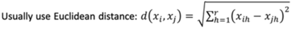
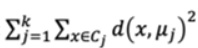

# Partition Based Clustering Algorithms
## K-Means(Centroid)
### Features
- Denote by `D = {x1, x2, ..., xn}` a set of n data items to be clustered.
- The i-th data item， denoted by `xi = [xi1, xi2, ..., xir]` is a **feature vector** with r entries.
### Distance Metric
- </img>
### Clustering Criterion
- **Number of clusters**: `k` is specified by expert knowledge or experience.
- **Large cohesion**: minimizing the **sum of squared error(SEE)**: </img>
