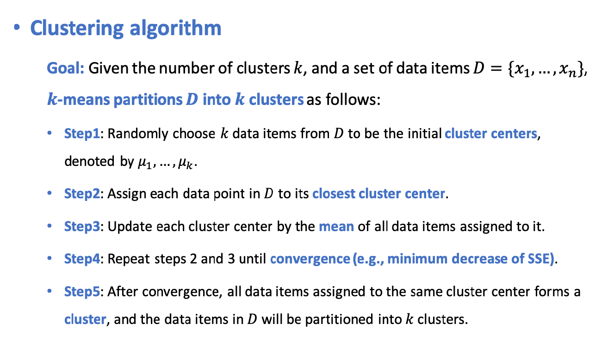

# Partition Based Clustering Algorithms
## K-Means(Centroid)
### Features
- Denote by `D = {x1, x2, ..., xn}` a set of n data items to be clustered.
- The i-th data item， denoted by `xi = [xi1, xi2, ..., xir]` is a **feature vector** with r entries.

### Distance Metric
- </img>

### Clustering Criterion
- **Number of clusters**: `k` is specified by expert knowledge or experience.
- **Large cohesion**: minimizing the **sum of squared error(SEE)**: </img>
  - `Cj` is the set of data items belonging to the j-th cluster.
  - `μj` is the cluster center of the j-yh cluster.
  
### Clustering Algorithm
- Given the number of clusters `k`, and a set of data items `D = {x1, ..., xn}`, **k-means partitions D into k clusters**.

</img>

