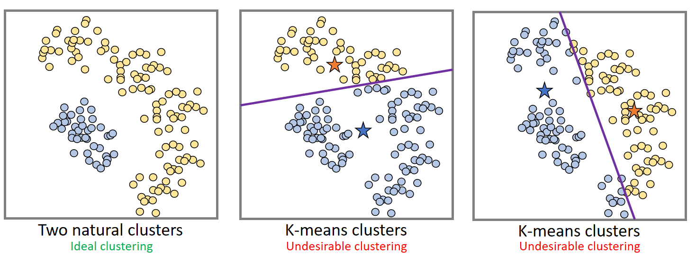

# Partition Based Clustering Algorithms
## K-Means(Centroid)
### Features
- Denote by `D = {x1, x2, ..., xn}` a set of n data items to be clustered.
- The i-th data item， denoted by `xi = [xi1, xi2, ..., xir]` is a **feature vector** with r entries.

### Distance Metric
- </img>

### Clustering Criterion
- **Number of clusters**: `k` is specified by expert knowledge or experience.
- **Large cohesion**: minimizing the **sum of squared error(SEE)**: </img>
  - `Cj` is the set of data items belonging to the j-th cluster.
  - `μj` is the cluster center of the j-yh cluster.
  
### Clustering Algorithm

</img>

### Strength
- **Simple**: easy to understand and implement.
- **Efficient**: time complexity is _**O(tkn)**_.
  - `t` is the number of iterations.
  - `k` is the number of clusters.
  - `n` is the number of data points.

### Weakness
- Only applicable when the mean of features is well defined.
  - **Applicable** for numerical feature(i.e. height, weight, age).
  - **Not directly application** to categorical feature(i.e. blood type, educational level).
- Not suitable for complicated clustering structures.

</img>

- Sensitive to the number of clusters `k`.
- Sensitive to initial cluster centers.
- Sensitive to outliers.
