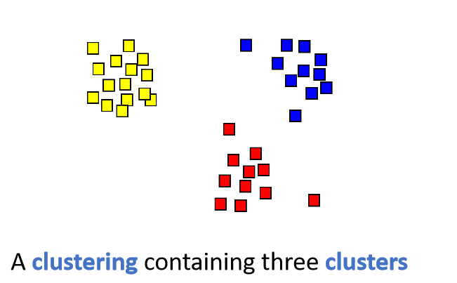

# Introduction to Clustering
## Clustering & Cluster
- **Clustering:** The organization of unlabeled data items into similarity groups called **clusters**.
- **Cluster:** A group of data items that are **similar** within the group, but are **dissimilar** to data items in other groups.

</img>

## Basic Components of a Clustering Algorithm
- [**Feature:**](#Features) A <ins>measurable property</ins> to <ins>represent an attribute of data items</ins>.
- **Distance Metric:** A function to <ins>evaluate the distance</ins> between two data items.
- **Clustering Criterion:** A function to <ins>evaluate the quality</ins> of a clustering.
- **Clustering Algorithm:** An algorithm to <ins>compute a good clustering</ins> by optimizing the clustering criterion.

## Features
- A **featrue** is an individual measurable property of a phenomenon being observed.
- A feature is **usually a real number** represent a property of data items.
- A data item `x` is represented by a feature vector `x = [x1, x2, ..., xr]`.

  

    <figure>
      
      <figcaption>The body of a person can be represented by two features: height and weight
</figcaption>
    </figure>
  

  

    <figure>
      
      <figcaption>A location on the map can be represented by two features: Latitude and Longitude
</figcaption>
    </figure>
  

