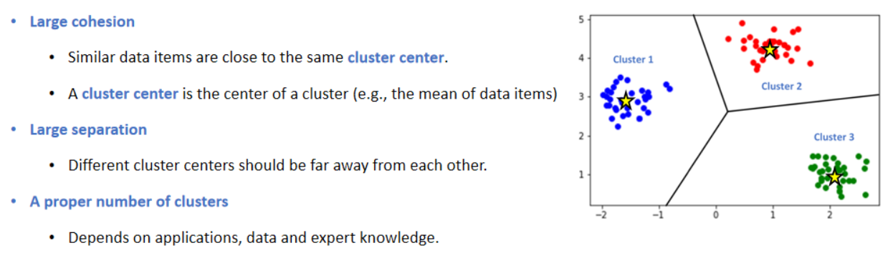

# Introduction to Clustering
- This study notes is from **Dr. Lingyang Chu**'s Guest Lecture at Mcmaster University.
## Clustering & Cluster
- **Clustering:** The organization of unlabeled data items into similarity groups called **clusters**.
- **Cluster:** A group of data items that are **similar** within the group, but are **dissimilar** to data items in other groups.

</img>

## Basic Components of a Clustering Algorithm
- [**Feature:**](#features) A <ins>measurable property</ins> to <ins>represent an attribute of data items</ins>.
- [**Distance Metric:**](#distance) A function to <ins>evaluate the distance</ins> between two data items.
- [**Clustering Criterion:**](#criterion) A function to <ins>evaluate the quality</ins> of a clustering.
- [**Clustering Algorithm:**](#algo) An algorithm to <ins>compute a good clustering</ins> by optimizing the clustering criterion.

## <a id="features">Features</a>
- A **featrue** is an individual measurable property of a phenomenon being observed.
- A feature is **usually a real number** represent a property of data items.
- A data item `x` is represented by a **feature vector** `x = [x1, x2, ..., xr]`.
</img></img>

## <a id="distance">Distance Metric</a>
- A **distance metric** is a function `d(x,y)` that defines the **distance** between two data items `x` and `y`.
  - A large distance means a small similarity
- Typical distance metrics for data items `x = [x1, ..., xr]` and `y = [y1, ..., yr]` include
</img>
- A distance metric `d(x,y)` should satisfy the following **three axioms**:
  - **Symmetry**: `d(x,y) = d(y,x)`
  - **Self-similarity**: `d(x,y) = 0 if and only if x= y`
  - **Triangle inequality**: `d(x,y) ≤ d(x,z) + d(z,y)`
  - The above three axioms also imply **Non-negativity**, that is `d(x,y) ≥	0`. 
    **Proof**: `0 = d(x,x) ≤ d(x,y) + d(y,x) = d(x,y) + d(x,y) = 2d(x,y)`
    
## <a id="criterion">Clustering Criterion</a>
- A **clustering criterion** is a function to evaluate the quality of clustering.
- Different clustering criterions apply to different scenarios, and lead to different clustering results.
- Most clustering criterions nvolve one or more of the following **three principles**:
</img>
- Example:
</img>

## <a id="algo">Clustering Algorithms</a>

</img>

 

- **Hierarchical algorithms**: iteratively generate a tree of clusters by finding successive clusters using previously found cluster.
 

</img>

 

- **Partition based algorithms**: determine all clusters together by partitioning all data items into a number of cluster.
 

</img>

 

- **Bayesian algorithms**: aim to generate a <ins>posterior distribution</ins> over the collection of all data items.
 

</img>

 
  

